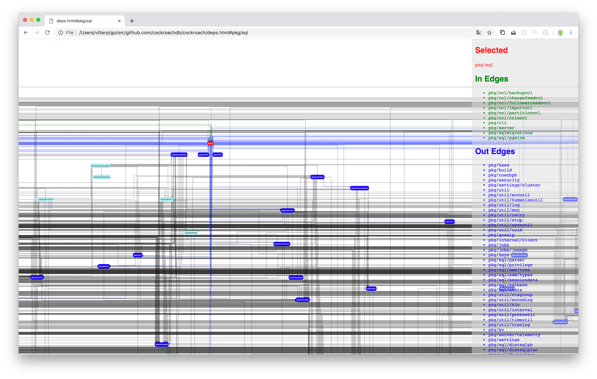

# DagView

Takes SVG output from GraphViz, and returns SVG with some JS and CSS
injected into it such that when you open it in your browser and
hover over a node:

- The node gets highlighted red
- The edges coming out of it become red
- The edges coming into it become green
- The nodes on the end of out edges are circled in red
- The nodes on the end of in edgees are circled in green

It looks like this:


[Live Demo](https://amazing-feynman-ce1493.netlify.com/example.svg)

## Usage

```bash
cat myfile.dot \
  | dot -Tsvg \
  | dagview \
  > out.svg
```
 
...and open up `out.svg` in your browser.
